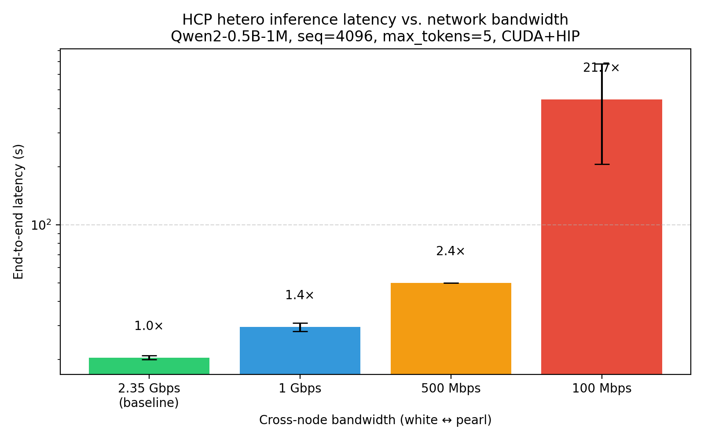

# HCP Bandwidth Sensitivity Matrix

**Date:** 2026-06-29  
**Hosts:** white (RTX 4090 CUDA) ↔ pearl (RX 9060 XT HIP) via 2.5 Gbps wired Ethernet  
**Model:** `/home/stark/models/Qwen2-0.5B-1M`  
**Workload:** seq_len=4096, max_tokens=5, 2-domain capacity-aware split  
**Method:** `tc tbf` rate limiting on the 192.168.100.x link, verified with `iperf3`

## Results

| Config      | iperf3 measured | Rep 1 | Rep 2 | Average | Slowdown vs baseline |
|-------------|-----------------|-------|-------|---------|----------------------|
| baseline    | 2.35 Gbps       | 21 s  | 20 s  | 20.5 s  | 1.0×                 |
| 1000 Mbps   | 951 Mbps        | 31 s  | 28 s  | 29.5 s  | 1.4×                 |
| 500 Mbps    | 478 Mbps        | 50 s  | 50 s  | 50.0 s  | 2.4×                 |
| 100 Mbps    | 94.9 Mbps       | 206 s | 684 s | 445 s*  | 21.7×*               |

\* 100 Mbps average uses the mean of the two reps; the large spread (206 s vs 684 s) is itself a finding and is tracked as an open uncertainty in graph memory.

## Plot

## Interpretation

1. **Non-linear penalty.** End-to-end latency grows faster than linearly as bandwidth drops. Even a modest reduction from 2.35 Gbps to 1 Gbps adds a 1.4× penalty; at 100 Mbps the penalty is roughly 20×.
2. **Communication dominates at low bandwidth.** The P2P KV ring in HCP passes every KV block between workers. When the link is slow, `recv` time dwarfs attention compute time (logs show `recv/compute` ratios in the thousands).
3. **Implication for CXL/RDMA.** Heterogeneous context parallelism can pool memory across dissimilar accelerators, but only if the interconnect can keep up with the KV traffic. Mainstream Ethernet at 100 Mbps–1 Gbps is insufficient; high-bandwidth, low-latency interconnects such as CXL, RDMA, or NVLink-class links are necessary for the approach to be practical.

## Caveats

- The 100 Mbps runs showed high variance (206 s vs 684 s). Possible causes include thermal throttling on pearl, QUIC congestion behavior, or tc burst settings; this should be reproduced and explained before using 100 Mbps as a headline number.
- The experiment uses a small model and a short sequence. Longer sequences and larger models will move even more data across the ring, likely making bandwidth requirements stricter.

## Artifacts

- Raw logs: `baseline_rep1/2`, `1000m_rep1/2`, `500m_rep1/2`, `100m_rep1/2`
- `times.csv`: machine-readable timing matrix
- `iperf_*.log`: bandwidth verification traces
